# DIAGRAM SISTEM
# Sistem Monitoring dan Pelaporan Kinerja Unit PT KAI Divre I Sumatera Utara

> Semua diagram menggunakan sintaks **Mermaid**.
> Untuk render: gunakan VS Code + extension "Mermaid Preview", atau paste ke https://mermaid.live

---

## A. USE CASE DIAGRAM

```mermaid
graph TB
    subgraph Actors["ACTORS"]
        UU["👤 User Unit"]
        AG["👤 Admin Global"]
        IT["👤 IT Support"]
    end

    subgraph System["SISTEM KAI"]
        subgraph Auth["Autentikasi"]
            UC1(["Login"])
            UC2(["Reset Password via Token"])
        end

        subgraph LaporanUC["Manajemen Laporan"]
            UC3(["Input Laporan Harian"])
            UC4(["Tambah Komoditi Barang"])
            UC5(["Input Target / RKAP"])
            UC6(["Validasi Internal Laporan"])
            UC7(["Submit Laporan"])
            UC8(["Lihat Status Laporan"])
            UC9(["Export Laporan PDF / Excel"])
        end

        subgraph AdminUC["Review & Monitoring"]
            UC10(["Review Laporan"])
            UC11(["ACC Laporan"])
            UC12(["Set Status REVISI"])
            UC13(["Monitor Semua Unit"])
            UC14(["Kelola Akun User"])
            UC15(["Kelola Unit"])
            UC16(["Lihat Dashboard & Grafik"])
        end

        subgraph HelpdeskUC["Helpdesk"]
            UC17(["Ajukan Helpdesk TOKEN"])
            UC18(["Ajukan Helpdesk ISSUE"])
            UC19(["Ajukan Helpdesk REVISION"])
            UC20(["Handle Helpdesk TOKEN"])
            UC21(["Handle Helpdesk ISSUE"])
            UC22(["Handle Helpdesk REVISION"])
            UC23(["Generate Token Reset Password"])
        end
    end

    UU --> UC1
    UU --> UC2
    UU --> UC3
    UU --> UC4
    UU --> UC5
    UU --> UC6
    UU --> UC7
    UU --> UC8
    UU --> UC9
    UU --> UC17
    UU --> UC18
    UU --> UC19

    AG --> UC1
    AG --> UC10
    AG --> UC11
    AG --> UC12
    AG --> UC13
    AG --> UC14
    AG --> UC15
    AG --> UC16
    AG --> UC22
    AG --> UC9

    IT --> UC1
    IT --> UC20
    IT --> UC21
    IT --> UC23
    IT --> UC13
```

---

## B. ACTIVITY DIAGRAMS

### B.1 — Activity: Login & Mekanisme Lock Akun

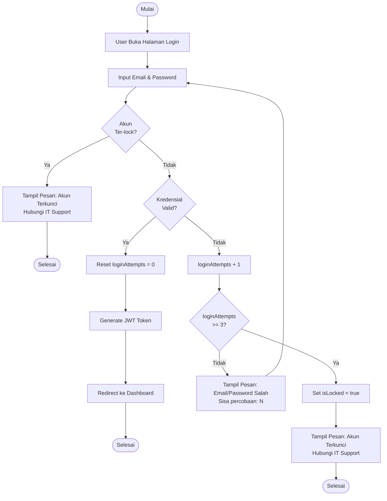

---

### B.2 — Activity: Reset Password via Token

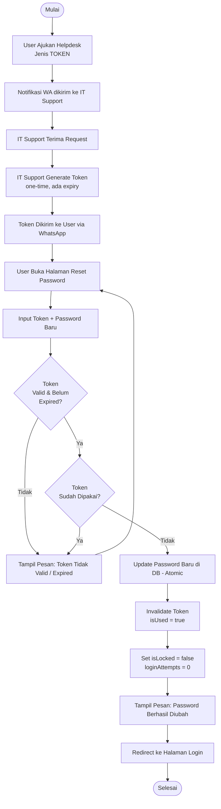

---

### B.3 — Activity: Input Laporan & Validasi Internal

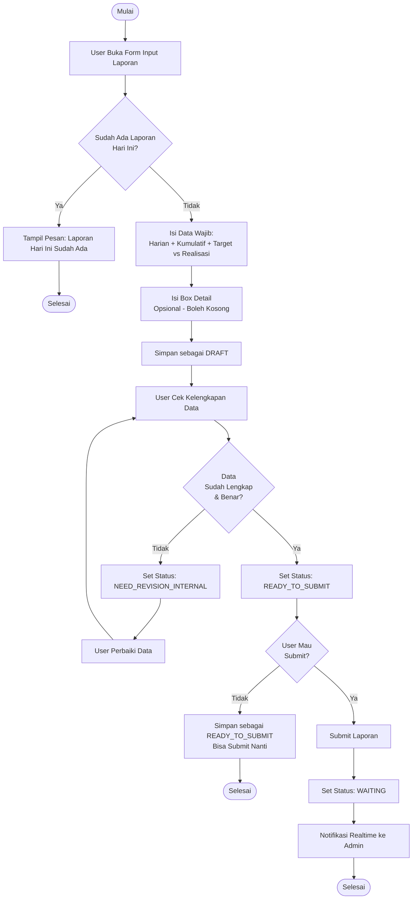

---

### B.4 — Activity: Admin Review Laporan

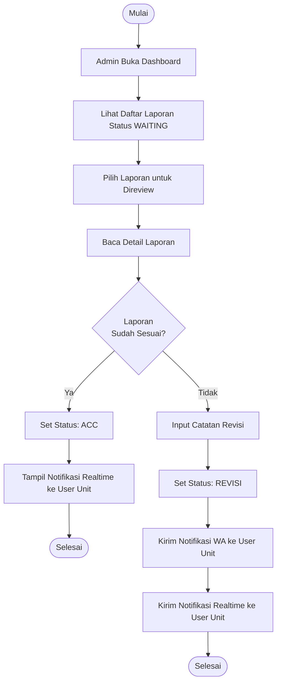

---

### B.5 — Activity: Edit Laporan Setelah Submit (via Helpdesk)

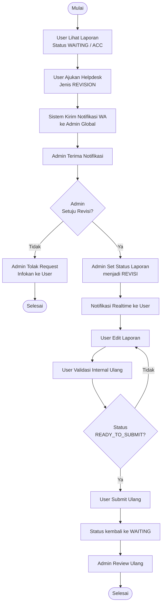

---

### B.6 — Activity: Helpdesk System

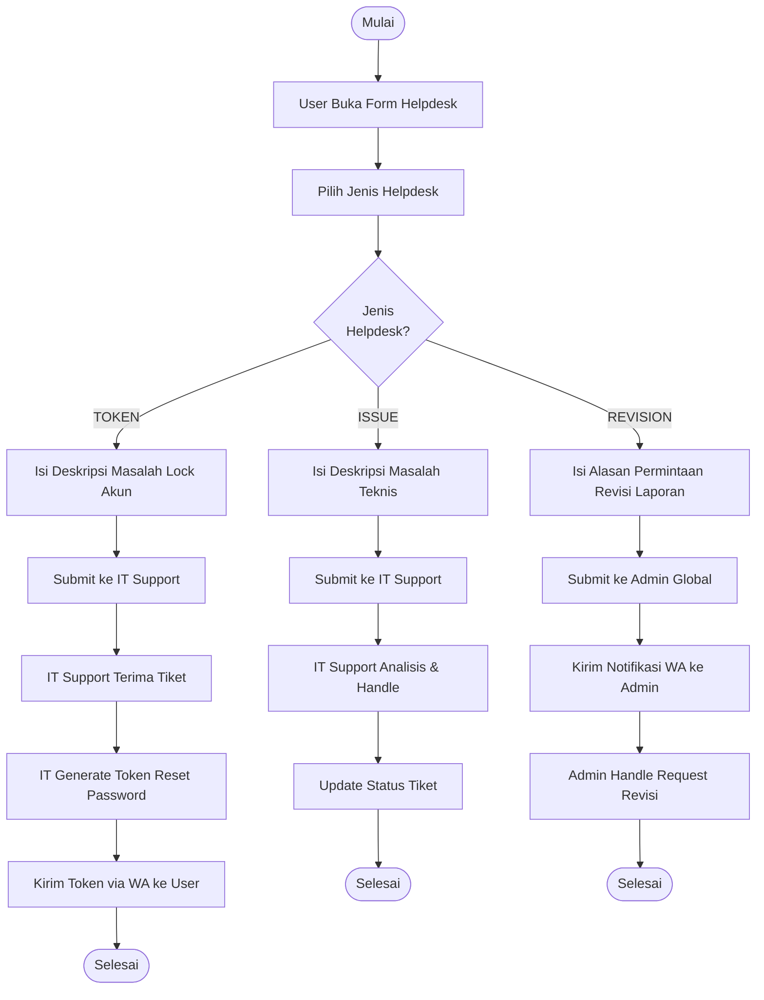

---

## C. SEQUENCE DIAGRAMS

### C.1 — Sequence: Login

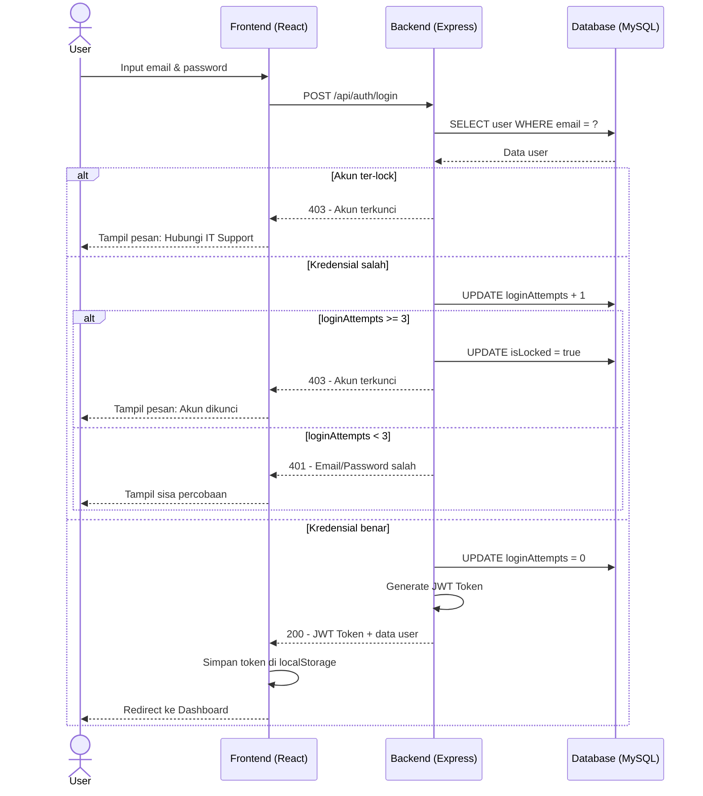

---

### C.2 — Sequence: Reset Password via Token

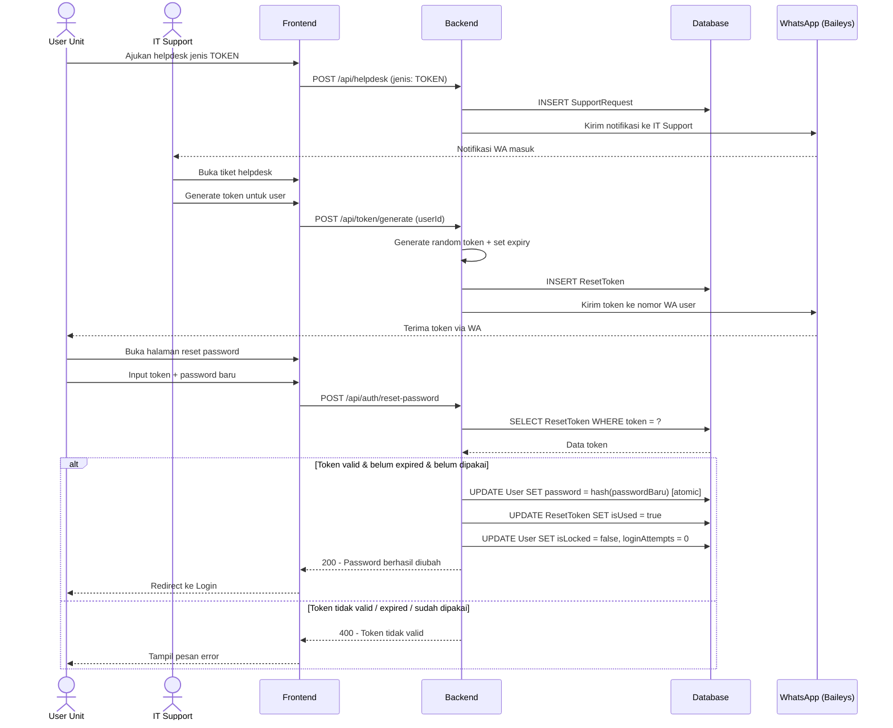

---

### C.3 — Sequence: Submit Laporan

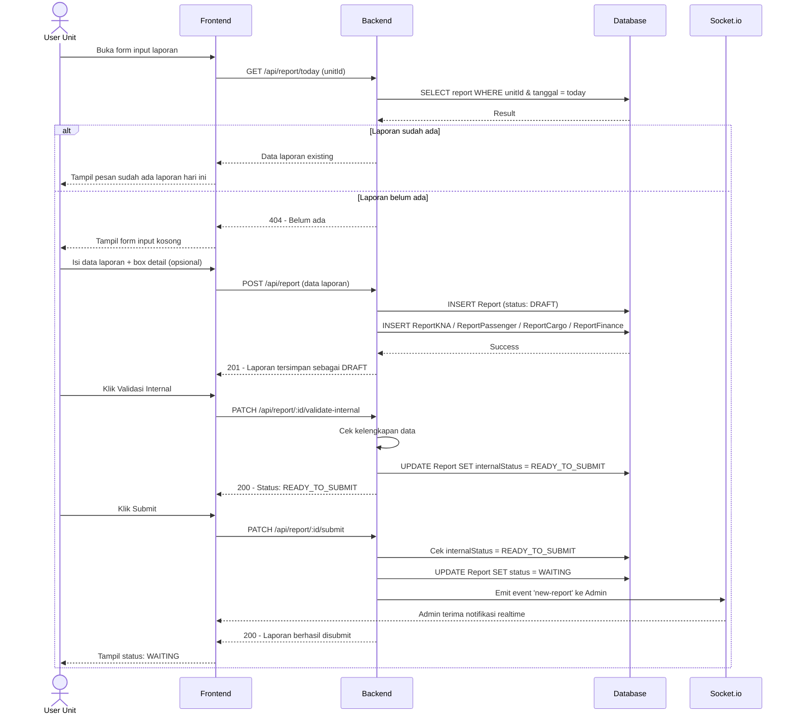

---

### C.4 — Sequence: Admin Review Laporan (ACC / REVISI)

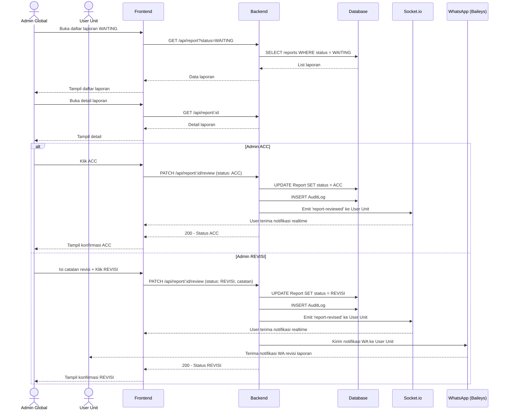

---

### C.5 — Sequence: Helpdesk REVISION (Edit Laporan Setelah Submit)

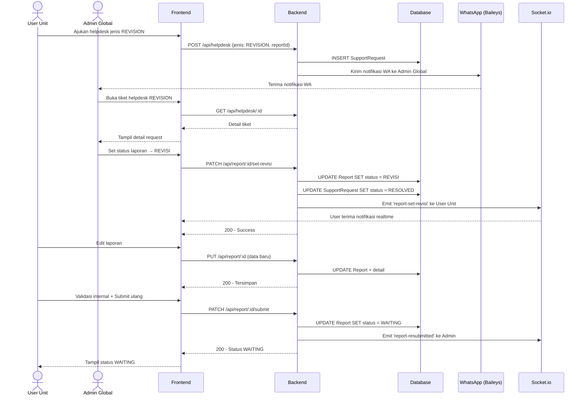

---

## D. ERD (ENTITY RELATIONSHIP DIAGRAM)

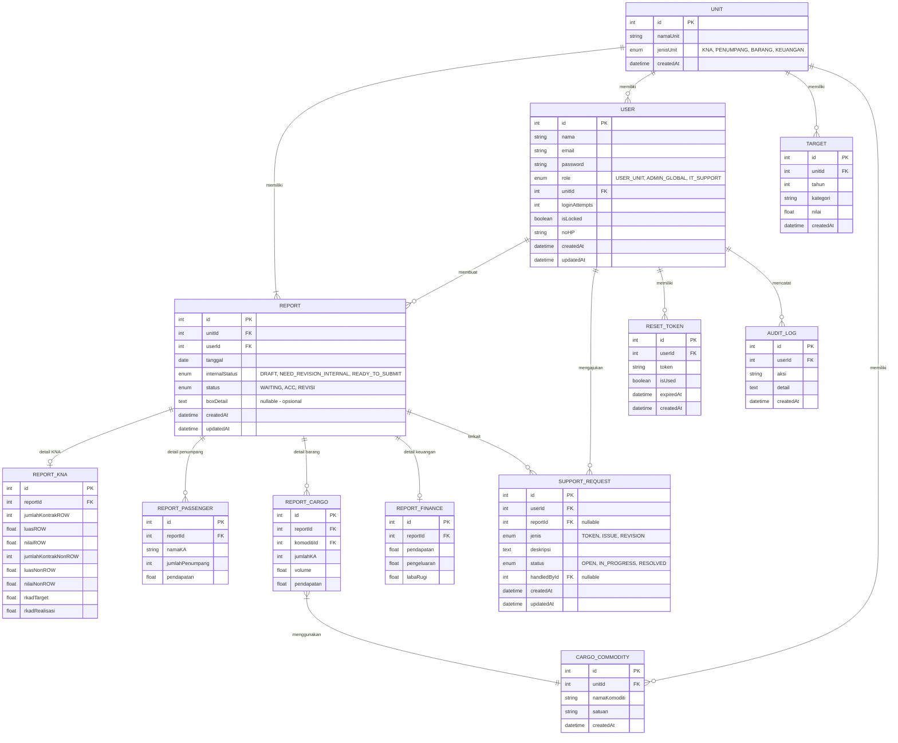

---

## E. DFD (DATA FLOW DIAGRAM)

### E.1 — DFD Level 0: Context Diagram

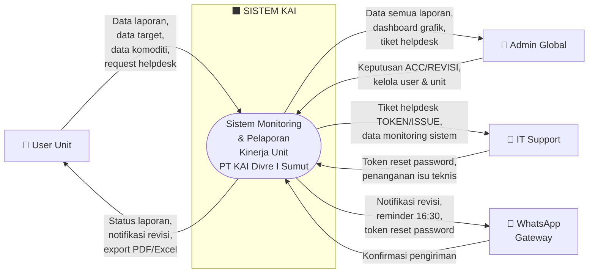

---

### E.2 — DFD Level 1: Dekomposisi Proses Utama

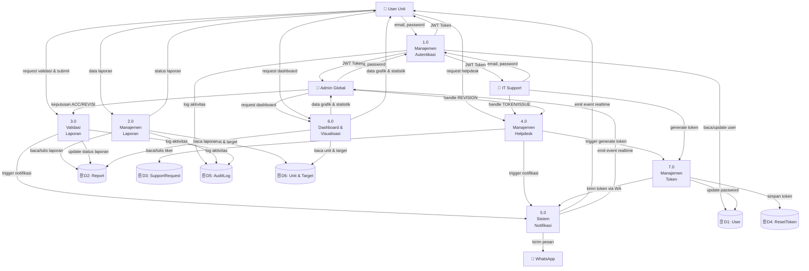

---

## F. RINGKASAN STATUS DIAGRAM

| Diagram | Jumlah | Keterangan |
|---------|--------|-----------|
| Use Case | 1 | 3 aktor, 23 use case |
| Activity | 6 | Login, Reset PW, Input Laporan, Admin Review, Edit via Helpdesk, Helpdesk |
| Sequence | 5 | Login, Reset PW, Submit Laporan, Admin Review, Helpdesk REVISION |
| ERD | 1 | 12 tabel, relasi lengkap |
| DFD Level 0 | 1 | Context diagram |
| DFD Level 1 | 1 | 7 proses utama |

---

*Untuk membuka diagram: gunakan VS Code + extension "Markdown Preview Mermaid Support", atau copy-paste tiap blok ke https://mermaid.live*
