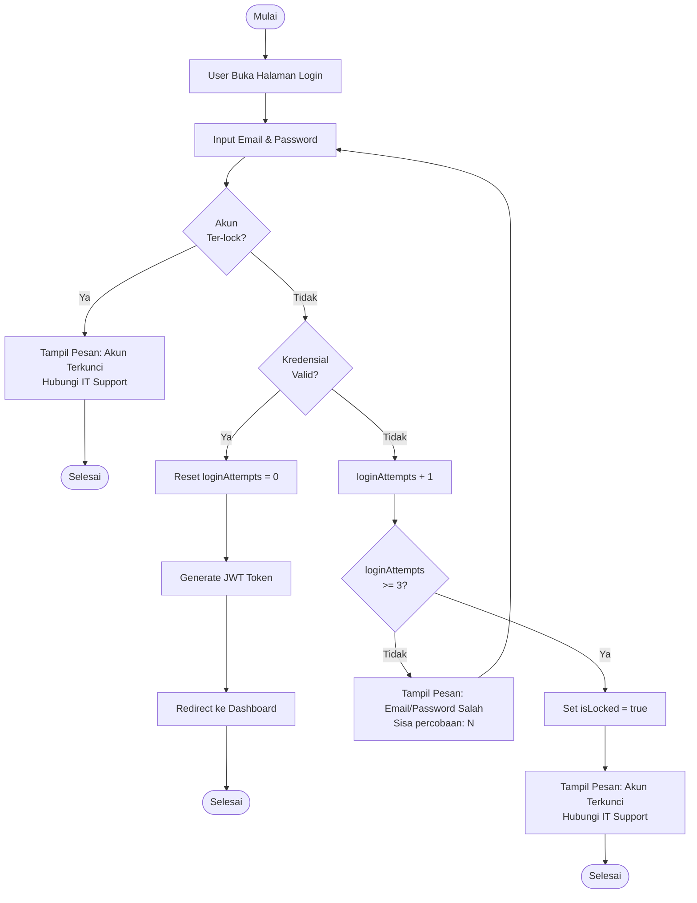

# ACTIVITY DIAGRAM — 1
# Login & Mekanisme Lock Akun

```mermaid
flowchart TD
    Start([Mulai]) --> A[User Buka Halaman Login]
    A --> B[Input Email & Password]
    B --> C{Akun\nTer-lock?}
    C -- Ya --> D[Tampil Pesan: Akun Terkunci\nHubungi IT Support]
    D --> End1([Selesai])
    C -- Tidak --> E{Kredensial\nValid?}
    E -- Ya --> F[Reset loginAttempts = 0]
    F --> G[Generate JWT Token]
    G --> H[Redirect ke Dashboard]
    H --> End2([Selesai])
    E -- Tidak --> I[loginAttempts + 1]
    I --> J{loginAttempts\n>= 3?}
    J -- Tidak --> K[Tampil Pesan: Email/Password Salah\nSisa percobaan: N]
    K --> B
    J -- Ya --> L[Set isLocked = true]
    L --> M[Tampil Pesan: Akun Terkunci\nHubungi IT Support]
    M --> End3([Selesai])
```
