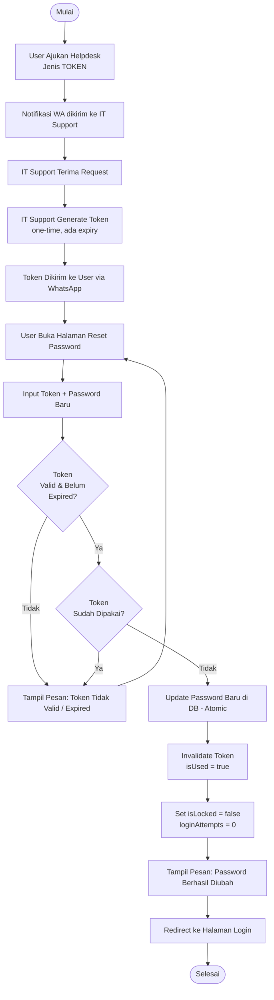

# ACTIVITY DIAGRAM — 2
# Reset Password via Token

```mermaid
flowchart TD
    Start([Mulai]) --> A[User Ajukan Helpdesk\nJenis TOKEN]
    A --> B[Notifikasi WA dikirim ke IT Support]
    B --> C[IT Support Terima Request]
    C --> D[IT Support Generate Token\none-time, ada expiry]
    D --> E[Token Dikirim ke User via WhatsApp]
    E --> F[User Buka Halaman Reset Password]
    F --> G[Input Token + Password Baru]
    G --> H{Token\nValid & Belum\nExpired?}
    H -- Tidak --> I[Tampil Pesan: Token Tidak Valid / Expired]
    I --> F
    H -- Ya --> J{Token\nSudah Dipakai?}
    J -- Ya --> I
    J -- Tidak --> K[Update Password Baru di DB - Atomic]
    K --> L[Invalidate Token\nisUsed = true]
    L --> M[Set isLocked = false\nloginAttempts = 0]
    M --> N[Tampil Pesan: Password Berhasil Diubah]
    N --> O[Redirect ke Halaman Login]
    O --> End([Selesai])
```
