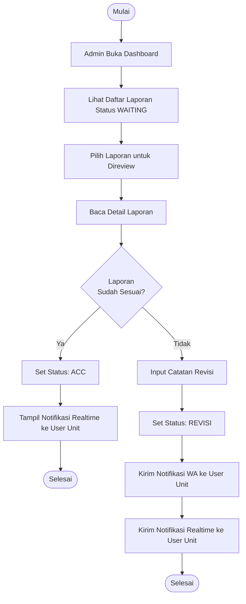

# ACTIVITY DIAGRAM — 4
# Admin Review Laporan (ACC / REVISI)

```mermaid
flowchart TD
    Start([Mulai]) --> A[Admin Buka Dashboard]
    A --> B[Lihat Daftar Laporan Status WAITING]
    B --> C[Pilih Laporan untuk Direview]
    C --> D[Baca Detail Laporan]
    D --> E{Laporan\nSudah Sesuai?}
    E -- Ya --> F[Set Status: ACC]
    F --> G[Tampil Notifikasi Realtime ke User Unit]
    G --> End1([Selesai])
    E -- Tidak --> H[Input Catatan Revisi]
    H --> I[Set Status: REVISI]
    I --> J[Kirim Notifikasi WA ke User Unit]
    J --> K[Kirim Notifikasi Realtime ke User Unit]
    K --> End2([Selesai])
```
