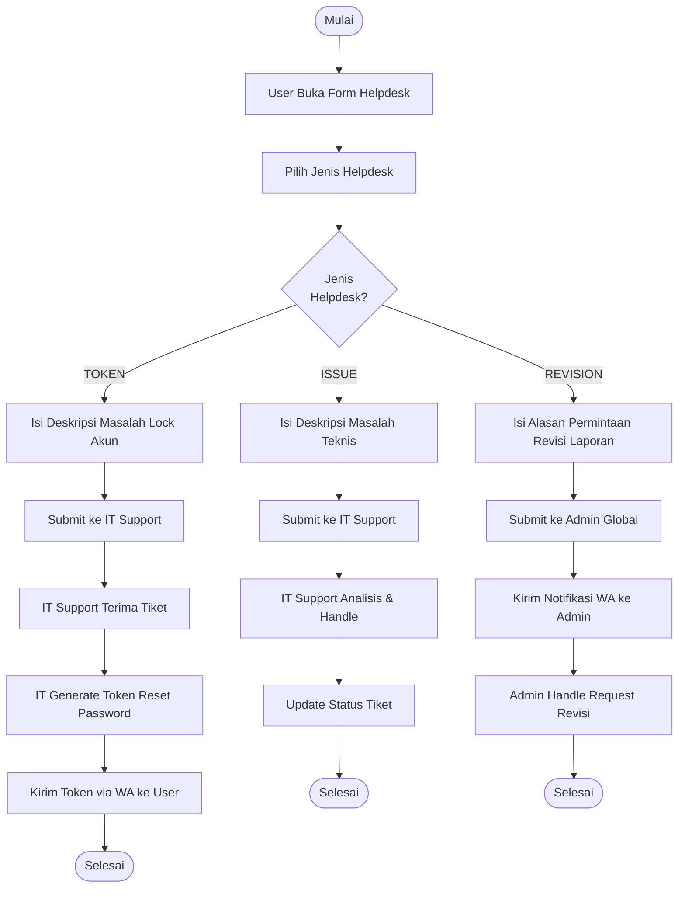

# ACTIVITY DIAGRAM — 6
# Helpdesk System (TOKEN / ISSUE / REVISION)

```mermaid
flowchart TD
    Start([Mulai]) --> A[User Buka Form Helpdesk]
    A --> B[Pilih Jenis Helpdesk]
    B --> C{Jenis\nHelpdesk?}

    C -- TOKEN --> D[Isi Deskripsi Masalah Lock Akun]
    D --> E[Submit ke IT Support]
    E --> F[IT Support Terima Tiket]
    F --> G[IT Generate Token Reset Password]
    G --> H[Kirim Token via WA ke User]
    H --> End1([Selesai])

    C -- ISSUE --> I[Isi Deskripsi Masalah Teknis]
    I --> J[Submit ke IT Support]
    J --> K[IT Support Analisis & Handle]
    K --> L[Update Status Tiket]
    L --> End2([Selesai])

    C -- REVISION --> M[Isi Alasan Permintaan Revisi Laporan]
    M --> N[Submit ke Admin Global]
    N --> O[Kirim Notifikasi WA ke Admin]
    O --> P[Admin Handle Request Revisi]
    P --> End3([Selesai])
```
