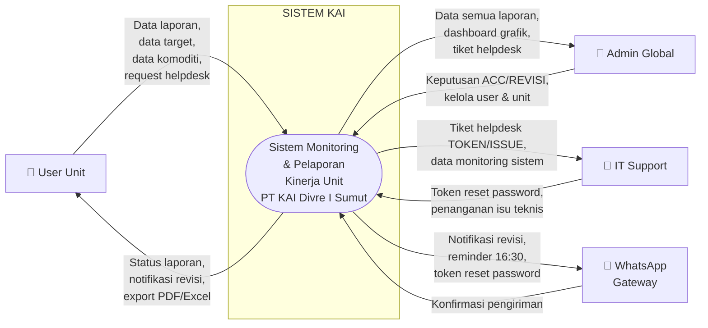

# DFD LEVEL 0 — CONTEXT DIAGRAM
# Sistem Monitoring & Pelaporan PT KAI Divre I Sumut

```mermaid
flowchart LR
    UU["👤 User Unit"]
    AG["👤 Admin Global"]
    IT["👤 IT Support"]
    WA["📱 WhatsApp\nGateway"]

    subgraph SYS["SISTEM KAI"]
        S(["Sistem Monitoring\n& Pelaporan\nKinerja Unit\nPT KAI Divre I Sumut"])
    end

    UU -- "Data laporan,\ndata target,\ndata komoditi,\nrequest helpdesk" --> S
    S -- "Status laporan,\nnotifikasi revisi,\nexport PDF/Excel" --> UU

    AG -- "Keputusan ACC/REVISI,\nkelola user & unit" --> S
    S -- "Data semua laporan,\ndashboard grafik,\ntiket helpdesk" --> AG

    IT -- "Token reset password,\npenanganan isu teknis" --> S
    S -- "Tiket helpdesk TOKEN/ISSUE,\ndata monitoring sistem" --> IT

    S -- "Notifikasi revisi,\nreminder 16:30,\ntoken reset password" --> WA
    WA -- "Konfirmasi pengiriman" --> S
```
