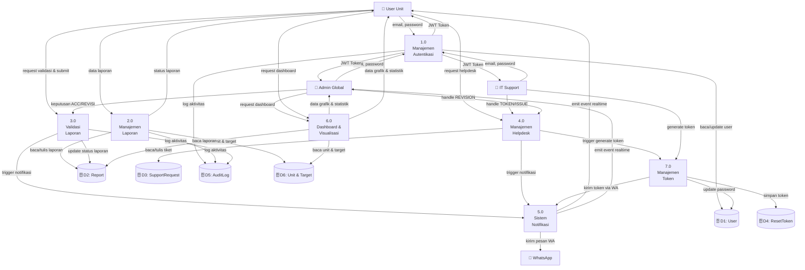

# DFD LEVEL 1 — DEKOMPOSISI PROSES UTAMA
# Sistem Monitoring & Pelaporan PT KAI Divre I Sumut

```mermaid
flowchart TD
    UU["👤 User Unit"]
    AG["👤 Admin Global"]
    IT["👤 IT Support"]
    WA["📱 WhatsApp"]

    P1["1.0\nManajemen\nAutentikasi"]
    P2["2.0\nManajemen\nLaporan"]
    P3["3.0\nValidasi\nLaporan"]
    P4["4.0\nManajemen\nHelpdesk"]
    P5["5.0\nSistem\nNotifikasi"]
    P6["6.0\nDashboard &\nVisualisasi"]
    P7["7.0\nManajemen\nToken"]

    DS1[("🗄 D1: User")]
    DS2[("🗄 D2: Report")]
    DS3[("🗄 D3: SupportRequest")]
    DS4[("🗄 D4: ResetToken")]
    DS5[("🗄 D5: AuditLog")]
    DS6[("🗄 D6: Unit & Target")]

    UU -- "email, password" --> P1
    AG -- "email, password" --> P1
    IT -- "email, password" --> P1
    P1 -- "JWT Token" --> UU
    P1 -- "JWT Token" --> AG
    P1 -- "JWT Token" --> IT
    P1 -- "baca/update user" --> DS1
    P1 -- "log aktivitas" --> DS5

    UU -- "data laporan" --> P2
    P2 -- "status laporan" --> UU
    P2 -- "baca/tulis laporan" --> DS2
    P2 -- "baca unit & target" --> DS6
    P2 -- "log aktivitas" --> DS5

    UU -- "request validasi & submit" --> P3
    AG -- "keputusan ACC/REVISI" --> P3
    P3 -- "update status laporan" --> DS2
    P3 -- "trigger notifikasi" --> P5
    P3 -- "log aktivitas" --> DS5

    UU -- "request helpdesk" --> P4
    IT -- "handle TOKEN/ISSUE" --> P4
    AG -- "handle REVISION" --> P4
    P4 -- "baca/tulis tiket" --> DS3
    P4 -- "trigger notifikasi" --> P5
    P4 -- "trigger generate token" --> P7

    P5 -- "kirim pesan WA" --> WA
    P5 -- "emit event realtime" --> UU
    P5 -- "emit event realtime" --> AG

    AG -- "request dashboard" --> P6
    UU -- "request dashboard" --> P6
    P6 -- "baca laporan" --> DS2
    P6 -- "baca unit & target" --> DS6
    P6 -- "data grafik & statistik" --> AG
    P6 -- "data grafik & statistik" --> UU

    IT -- "generate token" --> P7
    P7 -- "simpan token" --> DS4
    P7 -- "kirim token via WA" --> P5
    P7 -- "update password" --> DS1
```
