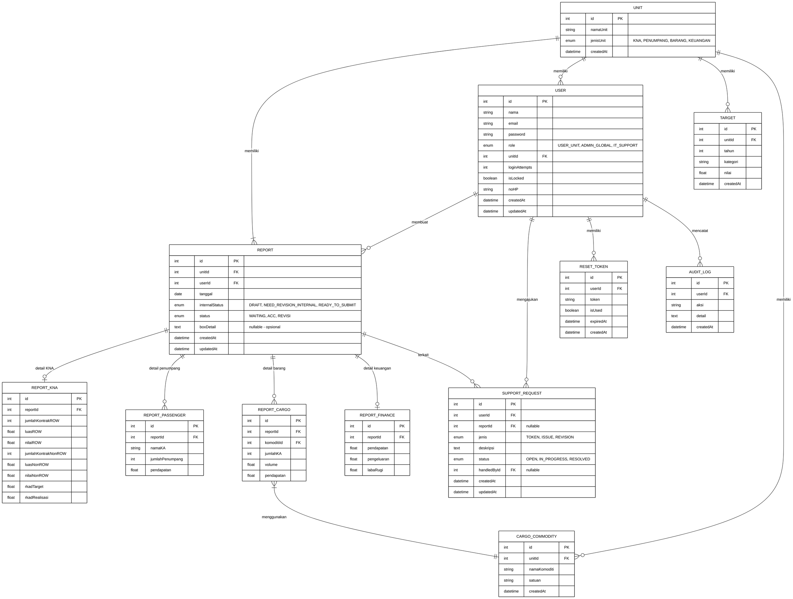

# ERD — ENTITY RELATIONSHIP DIAGRAM
# Sistem Monitoring & Pelaporan PT KAI Divre I Sumut

```mermaid
%%{init: {
  'theme': 'base',
  'themeVariables': {
    'primaryColor': '#ffffff',
    'primaryTextColor': '#000000',
    'primaryBorderColor': '#000000',
    'lineColor': '#000000',
    'secondaryColor': '#f5f5f5',
    'tertiaryColor': '#ffffff',
    'attributeBackgroundColorEven': '#ffffff',
    'attributeBackgroundColorOdd': '#f0f0f0',
    'fontFamily': 'arial',
    'fontSize': '14px'
  },
  'er': {
    'layoutDirection': 'TB',
    'minEntityWidth': 120,
    'minEntityHeight': 60,
    'entityPadding': 15,
    'diagramPadding': 30,
    'useMaxWidth': false
  }
}}%%
erDiagram
    USER {
        int id PK
        string nama
        string email
        string password
        enum role "USER_UNIT, ADMIN_GLOBAL, IT_SUPPORT"
        int unitId FK
        int loginAttempts
        boolean isLocked
        string noHP
        datetime createdAt
        datetime updatedAt
    }

    UNIT {
        int id PK
        string namaUnit
        enum jenisUnit "KNA, PENUMPANG, BARANG, KEUANGAN"
        datetime createdAt
    }

    REPORT {
        int id PK
        int unitId FK
        int userId FK
        date tanggal
        enum internalStatus "DRAFT, NEED_REVISION_INTERNAL, READY_TO_SUBMIT"
        enum status "WAITING, ACC, REVISI"
        text boxDetail "nullable - opsional"
        datetime createdAt
        datetime updatedAt
    }

    REPORT_KNA {
        int id PK
        int reportId FK
        int jumlahKontrakROW
        float luasROW
        float nilaiROW
        int jumlahKontrakNonROW
        float luasNonROW
        float nilaiNonROW
        float rkadTarget
        float rkadRealisasi
    }

    REPORT_PASSENGER {
        int id PK
        int reportId FK
        string namaKA
        int jumlahPenumpang
        float pendapatan
    }

    REPORT_CARGO {
        int id PK
        int reportId FK
        int komoditiId FK
        int jumlahKA
        float volume
        float pendapatan
    }

    CARGO_COMMODITY {
        int id PK
        int unitId FK
        string namaKomoditi
        string satuan
        datetime createdAt
    }

    REPORT_FINANCE {
        int id PK
        int reportId FK
        float pendapatan
        float pengeluaran
        float labaRugi
    }

    TARGET {
        int id PK
        int unitId FK
        int tahun
        string kategori
        float nilai
        datetime createdAt
    }

    SUPPORT_REQUEST {
        int id PK
        int userId FK
        int reportId FK "nullable"
        enum jenis "TOKEN, ISSUE, REVISION"
        text deskripsi
        enum status "OPEN, IN_PROGRESS, RESOLVED"
        int handledById FK "nullable"
        datetime createdAt
        datetime updatedAt
    }

    RESET_TOKEN {
        int id PK
        int userId FK
        string token
        boolean isUsed
        datetime expiredAt
        datetime createdAt
    }

    AUDIT_LOG {
        int id PK
        int userId FK
        string aksi
        text detail
        datetime createdAt
    }

    USER ||--o{ REPORT : "membuat"
    UNIT ||--|{ REPORT : "memiliki"
    UNIT ||--o{ USER : "memiliki"
    UNIT ||--o{ TARGET : "memiliki"
    UNIT ||--o{ CARGO_COMMODITY : "memiliki"

    REPORT ||--o| REPORT_KNA : "detail KNA"
    REPORT ||--o{ REPORT_PASSENGER : "detail penumpang"
    REPORT ||--o{ REPORT_CARGO : "detail barang"
    REPORT ||--o| REPORT_FINANCE : "detail keuangan"

    REPORT_CARGO }|--|| CARGO_COMMODITY : "menggunakan"

    USER ||--o{ SUPPORT_REQUEST : "mengajukan"
    USER ||--o{ RESET_TOKEN : "memiliki"
    USER ||--o{ AUDIT_LOG : "mencatat"
    REPORT ||--o{ SUPPORT_REQUEST : "terkait"
```
