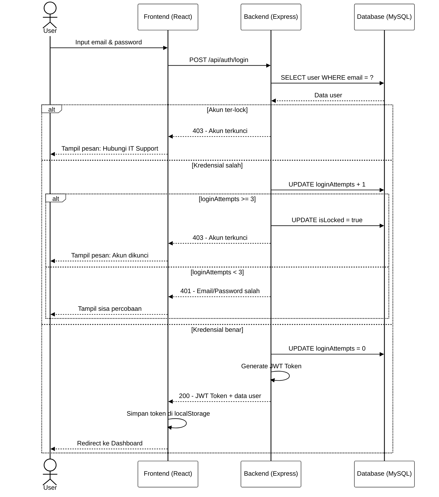

# SEQUENCE DIAGRAM — 1
# Login

```mermaid
%%{init: {'theme': 'base', 'themeVariables': {'actorBkg': '#ffffff', 'actorBorder': '#000000', 'actorTextColor': '#000000', 'actorLineColor': '#000000', 'signalColor': '#000000', 'signalTextColor': '#000000', 'labelBoxBkgColor': '#ffffff', 'labelBoxBorderColor': '#000000', 'labelTextColor': '#000000', 'loopTextColor': '#000000', 'noteBkgColor': '#ffffff', 'noteBorderColor': '#000000', 'noteTextColor': '#000000', 'activationBkgColor': '#f0f0f0', 'activationBorderColor': '#000000'}}}%%
sequenceDiagram
    actor U as User
    participant FE as Frontend (React)
    participant BE as Backend (Express)
    participant DB as Database (MySQL)

    U->>FE: Input email & password
    FE->>BE: POST /api/auth/login
    BE->>DB: SELECT user WHERE email = ?
    DB-->>BE: Data user

    alt Akun ter-lock
        BE-->>FE: 403 - Akun terkunci
        FE-->>U: Tampil pesan: Hubungi IT Support
    else Kredensial salah
        BE->>DB: UPDATE loginAttempts + 1
        alt loginAttempts >= 3
            BE->>DB: UPDATE isLocked = true
            BE-->>FE: 403 - Akun terkunci
            FE-->>U: Tampil pesan: Akun dikunci
        else loginAttempts < 3
            BE-->>FE: 401 - Email/Password salah
            FE-->>U: Tampil sisa percobaan
        end
    else Kredensial benar
        BE->>DB: UPDATE loginAttempts = 0
        BE->>BE: Generate JWT Token
        BE-->>FE: 200 - JWT Token + data user
        FE->>FE: Simpan token di localStorage
        FE-->>U: Redirect ke Dashboard
    end
```
