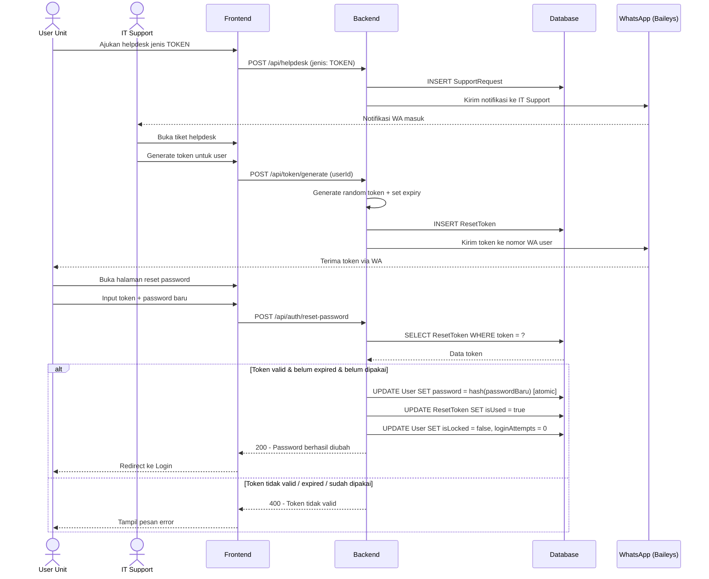

# SEQUENCE DIAGRAM — 2
# Reset Password via Token

```mermaid
sequenceDiagram
    actor U as User Unit
    actor IT as IT Support
    participant FE as Frontend
    participant BE as Backend
    participant DB as Database
    participant WA as WhatsApp (Baileys)

    U->>FE: Ajukan helpdesk jenis TOKEN
    FE->>BE: POST /api/helpdesk (jenis: TOKEN)
    BE->>DB: INSERT SupportRequest
    BE->>WA: Kirim notifikasi ke IT Support
    WA-->>IT: Notifikasi WA masuk

    IT->>FE: Buka tiket helpdesk
    IT->>FE: Generate token untuk user
    FE->>BE: POST /api/token/generate (userId)
    BE->>BE: Generate random token + set expiry
    BE->>DB: INSERT ResetToken
    BE->>WA: Kirim token ke nomor WA user
    WA-->>U: Terima token via WA

    U->>FE: Buka halaman reset password
    U->>FE: Input token + password baru
    FE->>BE: POST /api/auth/reset-password
    BE->>DB: SELECT ResetToken WHERE token = ?
    DB-->>BE: Data token

    alt Token valid & belum expired & belum dipakai
        BE->>DB: UPDATE User SET password = hash(passwordBaru) [atomic]
        BE->>DB: UPDATE ResetToken SET isUsed = true
        BE->>DB: UPDATE User SET isLocked = false, loginAttempts = 0
        BE-->>FE: 200 - Password berhasil diubah
        FE-->>U: Redirect ke Login
    else Token tidak valid / expired / sudah dipakai
        BE-->>FE: 400 - Token tidak valid
        FE-->>U: Tampil pesan error
    end
```
