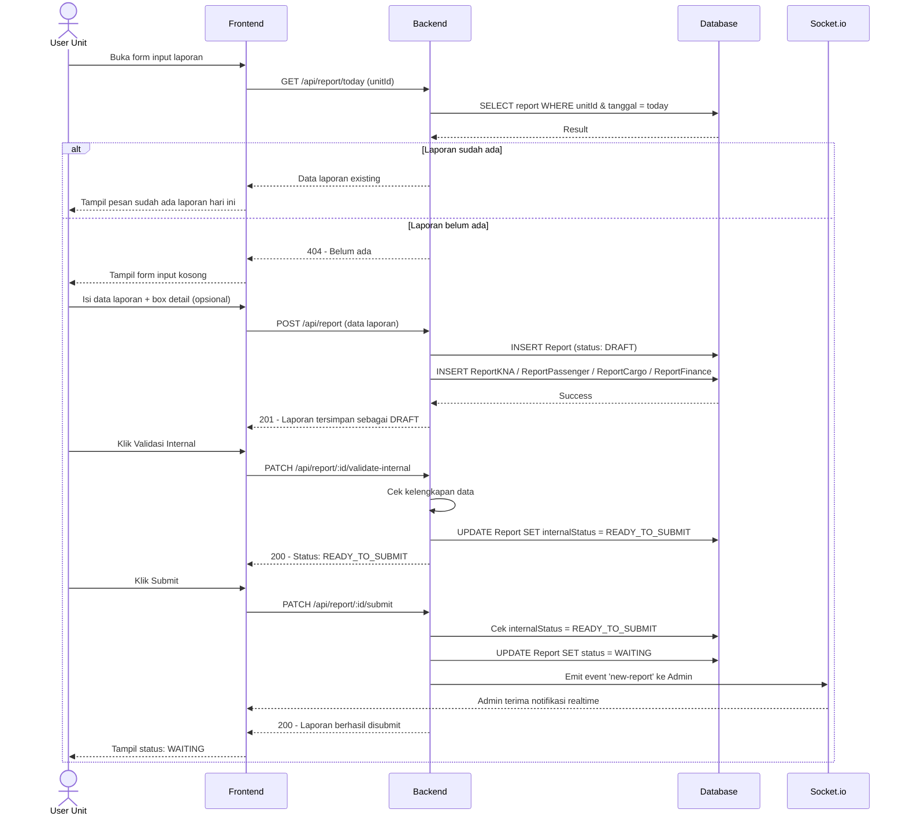

# SEQUENCE DIAGRAM — 3
# Submit Laporan

```mermaid
sequenceDiagram
    actor U as User Unit
    participant FE as Frontend
    participant BE as Backend
    participant DB as Database
    participant SO as Socket.io

    U->>FE: Buka form input laporan
    FE->>BE: GET /api/report/today (unitId)
    BE->>DB: SELECT report WHERE unitId & tanggal = today
    DB-->>BE: Result

    alt Laporan sudah ada
        BE-->>FE: Data laporan existing
        FE-->>U: Tampil pesan sudah ada laporan hari ini
    else Laporan belum ada
        BE-->>FE: 404 - Belum ada
        FE-->>U: Tampil form input kosong

        U->>FE: Isi data laporan + box detail (opsional)
        FE->>BE: POST /api/report (data laporan)
        BE->>DB: INSERT Report (status: DRAFT)
        BE->>DB: INSERT ReportKNA / ReportPassenger / ReportCargo / ReportFinance
        DB-->>BE: Success
        BE-->>FE: 201 - Laporan tersimpan sebagai DRAFT

        U->>FE: Klik Validasi Internal
        FE->>BE: PATCH /api/report/:id/validate-internal
        BE->>BE: Cek kelengkapan data
        BE->>DB: UPDATE Report SET internalStatus = READY_TO_SUBMIT
        BE-->>FE: 200 - Status: READY_TO_SUBMIT

        U->>FE: Klik Submit
        FE->>BE: PATCH /api/report/:id/submit
        BE->>DB: Cek internalStatus = READY_TO_SUBMIT
        BE->>DB: UPDATE Report SET status = WAITING
        BE->>SO: Emit event 'new-report' ke Admin
        SO-->>FE: Admin terima notifikasi realtime
        BE-->>FE: 200 - Laporan berhasil disubmit
        FE-->>U: Tampil status: WAITING
    end
```
