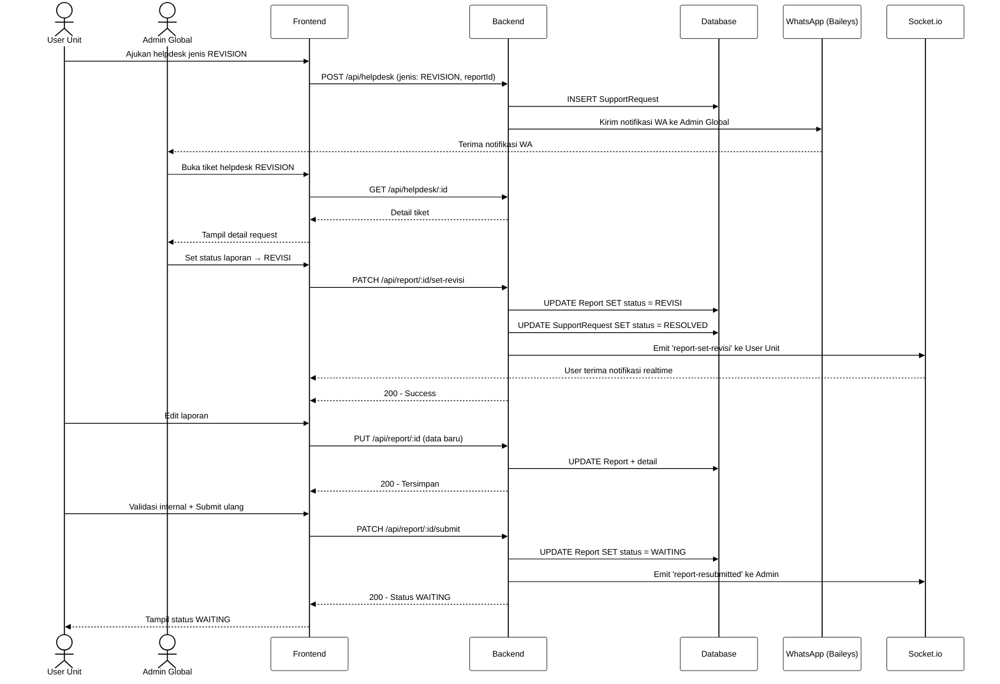

# SEQUENCE DIAGRAM — 5
# Helpdesk REVISION (Edit Laporan Setelah Submit)

```mermaid
%%{init: {'theme': 'base', 'themeVariables': {'actorBkg': '#ffffff', 'actorBorder': '#000000', 'actorTextColor': '#000000', 'actorLineColor': '#000000', 'signalColor': '#000000', 'signalTextColor': '#000000', 'labelBoxBkgColor': '#ffffff', 'labelBoxBorderColor': '#000000', 'labelTextColor': '#000000', 'loopTextColor': '#000000', 'noteBkgColor': '#ffffff', 'noteBorderColor': '#000000', 'noteTextColor': '#000000', 'activationBkgColor': '#f0f0f0', 'activationBorderColor': '#000000'}}}%%
sequenceDiagram
    actor U as User Unit
    actor A as Admin Global
    participant FE as Frontend
    participant BE as Backend
    participant DB as Database
    participant WA as WhatsApp (Baileys)
    participant SO as Socket.io

    U->>FE: Ajukan helpdesk jenis REVISION
    FE->>BE: POST /api/helpdesk (jenis: REVISION, reportId)
    BE->>DB: INSERT SupportRequest
    BE->>WA: Kirim notifikasi WA ke Admin Global
    WA-->>A: Terima notifikasi WA

    A->>FE: Buka tiket helpdesk REVISION
    FE->>BE: GET /api/helpdesk/:id
    BE-->>FE: Detail tiket
    FE-->>A: Tampil detail request

    A->>FE: Set status laporan → REVISI
    FE->>BE: PATCH /api/report/:id/set-revisi
    BE->>DB: UPDATE Report SET status = REVISI
    BE->>DB: UPDATE SupportRequest SET status = RESOLVED
    BE->>SO: Emit 'report-set-revisi' ke User Unit
    SO-->>FE: User terima notifikasi realtime
    BE-->>FE: 200 - Success

    U->>FE: Edit laporan
    FE->>BE: PUT /api/report/:id (data baru)
    BE->>DB: UPDATE Report + detail
    BE-->>FE: 200 - Tersimpan

    U->>FE: Validasi internal + Submit ulang
    FE->>BE: PATCH /api/report/:id/submit
    BE->>DB: UPDATE Report SET status = WAITING
    BE->>SO: Emit 'report-resubmitted' ke Admin
    BE-->>FE: 200 - Status WAITING
    FE-->>U: Tampil status WAITING
```
