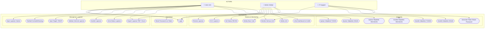

# USE CASE DIAGRAM
# Sistem Monitoring & Pelaporan PT KAI Divre I Sumut

```mermaid
graph TB
    subgraph Actors["ACTORS"]
        UU["👤 User Unit"]
        AG["👤 Admin Global"]
        IT["👤 IT Support"]
    end

    subgraph System["SISTEM KAI"]
        subgraph Auth["Autentikasi"]
            UC1(["Login"])
            UC2(["Reset Password via Token"])
        end

        subgraph LaporanUC["Manajemen Laporan"]
            UC3(["Input Laporan Harian"])
            UC4(["Tambah Komoditi Barang"])
            UC5(["Input Target / RKAP"])
            UC6(["Validasi Internal Laporan"])
            UC7(["Submit Laporan"])
            UC8(["Lihat Status Laporan"])
            UC9(["Export Laporan PDF / Excel"])
        end

        subgraph AdminUC["Review & Monitoring"]
            UC10(["Review Laporan"])
            UC11(["ACC Laporan"])
            UC12(["Set Status REVISI"])
            UC13(["Monitor Semua Unit"])
            UC14(["Kelola Akun User"])
            UC15(["Kelola Unit"])
            UC16(["Lihat Dashboard & Grafik"])
        end

        subgraph HelpdeskUC["Helpdesk"]
            UC17(["Ajukan Helpdesk TOKEN"])
            UC18(["Ajukan Helpdesk ISSUE"])
            UC19(["Ajukan Helpdesk REVISION"])
            UC20(["Handle Helpdesk TOKEN"])
            UC21(["Handle Helpdesk ISSUE"])
            UC22(["Handle Helpdesk REVISION"])
            UC23(["Generate Token Reset Password"])
        end
    end

    UU --> UC1
    UU --> UC2
    UU --> UC3
    UU --> UC4
    UU --> UC5
    UU --> UC6
    UU --> UC7
    UU --> UC8
    UU --> UC9
    UU --> UC17
    UU --> UC18
    UU --> UC19

    AG --> UC1
    AG --> UC10
    AG --> UC11
    AG --> UC12
    AG --> UC13
    AG --> UC14
    AG --> UC15
    AG --> UC16
    AG --> UC22
    AG --> UC9

    IT --> UC1
    IT --> UC20
    IT --> UC21
    IT --> UC23
    IT --> UC13
```
